# 🚀 Terraform Azure Infrastructure

<p align="center">
  <a href="https://github.com/Nm-mutua/terraform-azure-infra/actions/workflows/terraform.yml">
    
  </a>
</p>

This project provisions a complete Azure infrastructure using Terraform, including:

- Azure Resource Group  
- Virtual Network & Subnet  
- Network Security Group (NSG) and rules  
- Public IP and Network Interface  
- Ubuntu Linux Virtual Machine  
- Cloud-init for VM configuration via `customdata.tpl`  
- Automated server configuration and hardening with Ansible (see [Apache Setup & Hardening](#apache-setup--hardening))  

---

## 📁 Project Structure

```
.
├── .github/
│   └── workflows/
│       └── terraform.yml                   # CI/CD: fmt/validate/plan on PR, apply on main (OIDC)
│
├── main.tf                                 # Core IaC: RG, VNet/NIC/VM, Key Vault, Secret
├── variables.tf                            # Input variables
├── providers.tf                            # Provider + required versions (recommended)
├── outputs.tf                              # Outputs: public IP, client_id, LA workspace id/name
├── monitor_diagnostics.tf                  # VM -> Diagnostic Setting (AllMetrics to LA)
├── monitor_ama_dcr.tf                      # DCE, DCR (syslog/perf), DCR association to VM
├── osx.tfvars                              # Local var values (used with -var-file)
│
├── queries/                                # KQL for docs + quick copy
│   ├── syslog.kql
│   └── perf.kql
│
├── scripts/                                # Helper scripts
│   ├── install_ansible.sh                  # Install Ansible on control node
│   └── generate_vm_load.sh                 # Optional: create OS activity to see metrics/logs
│
├── ansible/
│   ├── playbook.yml                        # Apache + hardening
│   ├── inventory.ini
│   ├── roles/
│   │   ├── apache/
│   │   ├── security/
│   │   └── docker/                         # optional
│   └── group_vars/
│       └── all.yml
│
├── templates/
│   └── customdata.tpl                      # cloud-init script for VM provisioning
│
├── screenshots/                            # Images used in README (case-sensitive on GitHub)
│   ├── ci-cd/                              # NEW: pipeline + backend setup
│   │   ├── Az_Group_Create_Success.png
│   │   ├── Az_Storage_Account_Create_Success.png
│   │   ├── Az_Storage_Container_Create_Success.png
│   │   ├── Storage_Account_In_Azure_Portal.png
│   │   ├── Azure_Login_Success.png
│   │   ├── Secrets_And_Variables.png
│   │   ├── Terraform_Init_Azure_Remote_Backend.png
│   │   ├── Terraform_Validate_Success.png
│   │   └── Terraform_Plan_Success.png
│   └── infra/                              # original infra screenshots
│       ├── Terraform_Plan.png
│       ├── Terraform_Apply.png
│       ├── terraform-output.png
│       ├── Ansible_Playbook_Run.png
│       ├── Apache2_Service_Status.png
│       ├── Apache2_Ubuntu_Default_Page.png
│       ├── Fail2Ban_SSH_Jail_Status.png
│       ├── Keyvault_Secret_Success.png
│       ├── Keyvault_Secret_Detail.png
│       ├── Keyvault_Access_Policy.png
│       ├── Azure_Log_Analytics_Workspace_Installed.png
│       ├── Azure_Monitor_Linux_Agent_Installed.png
│       ├── Azurerm_Log_Analytics_Workspace_Apply_Output.png
│       ├── Azurerm_Monitor_Data_Collection_Endpoint_Apply_Output.png
│       ├── Azurerm_Monitor_Data_Collection_Rule_Apply_Output.png
│       ├── Azurerm_Monitor_Data_Collection_Rule_Association_Apply_Output.png
│       ├── Data_Collection_Endpoint_Configured.png
│       ├── Data_Collection_Rule_Configured.png
│       ├── Mtc_VM_Associated_With_DCR.png
│       ├── Syslog_Logs_Populated.PNG
│       └── Perf_Logs_Populated.PNG
│
├── .gitignore
├── .terraform.lock.hcl
└── README.md

```

## ⚙️ Getting Started

### ✅ Prerequisites

- **Azure subscription** with permissions to create RG, VNets, VMs, Key Vault, and Log Analytics  
  *(Owner, or Contributor + User Access Admin)*
- **Terraform v1.4+**
- **Azure CLI**
- **SSH** tools (for cloud-init public key handling)
- **Ubuntu 20.04 LTS** image (target VM)
- **Ansible v2.10+**
- **Python 3**
- **GitHub Actions** (repo has workflow enabled)
- **Azure Key Vault**
- **GitHub** for version control
- **Log Analytics Workspace** (AMA/DCR destination; can be created by Terraform or pre-existing)

> ℹ️ In CI (GitHub Actions) you’ll use OIDC with `azure/login`; locally you’ll use `az login`.

#### Quick verify

```bash
terraform -version
az version
python3 --version
ansible --version


### ▶️ Usage

```bash
terraform fmt                        # Format code
terraform validate                   # Check for syntax errors
terraform init                       # Initialize the directory
terraform plan                       # Preview the changes
terraform apply -auto-approve        # Apply changes
```

## Post-Deployment Configuration

After successful provisioning with Terraform, the following configuration was performed on the Azure VM (mtc-vm):

- ✅ Installed Docker Engine on Ubuntu 20.04 LTS
- 🛠️ Verified installation using: docker --version
- 📦 Purpose: Prepares the VM for container-based workloads (optional future expansion)
- 📜 Installed via cloud-init script defined in [`customdata.tpl`](./customdata.tpl)
- 📂 All configurations handled through ansible/playbook.yml

## CI/CD with GitHub Actions (Terraform)

[](https://github.com/Nm-mutua/terraform-azure-infra/actions/workflows/terraform.yml)

Workflow file: [`.github/workflows/terraform.yml`](.github/workflows/terraform.yml)

**What the pipeline does**
- Triggers on `push` and `pull_request` to `main`.
- Authenticates to Azure via **OIDC** (no stored cloud creds).
- Uses Azure Storage as the **remote backend** for Terraform state.
- Runs `terraform fmt`, `validate`, and `plan`; uploads the plan as an artifact.
- (PRs) Posts the plan summary as a comment.
- (Pushes to `main`) Applies the saved plan automatically.

This project integrates with GitHub Actions to run Terraform automatically. Used automation steps include:

- **Terraform**: `terraform fmt` `validate` , and `test`
- **Ansible linting**: Ensure playbook syntax and best practices
- **SSH deployment**: Deploy playbook to Azure VM using CI pipeline
- **Security Scans** Use `tfsec` and `ansible-lint` for code scanning
- **Apache Setup & Hardening**:
  - ✅ Installed Apache Web Server using Ansible playbook
  - 📄 Apache is configured to serve a default index.html page
  - 🔐 Hardened with UFW (Allow 22, 80), Fail2Ban
  - 📂 All configurations handled through ansible/playbook.yml

## 🔐 Secure Credentials with Azure Key Vault using Terraform

This section demonstrates how I used Terraform to deploy an Azure Key Vault instance and securely store a secret.

### 🚀 Steps

1. Define Key Vault in Terraform
   - I used the azurerm_key_vault resource to deploy Key Vault and attach proper access policies for my Service Principal.

2. Add Access Policy
   - The policy grants permission to get, list, and set secrets (see screenshot).

3. Inject Secret via Terraform
   - I created a sample secret (e.g., a database password) using the azurerm_key_vault_secret resource.

4. Verify Key Vault Deployment
   - After running terraform apply, the Key Vault and its secret were successfully provisioned.
       - ✅ Plan phase:
       - ✅ Apply phase:

5. Secret Confirmed in Azure Portal
   - The secret was successfully created and stored securely.
       - ✅ Success toast:
       - 🔍 Secret details:

## ✅ Outcome
    - This demo shows how sensitive data (such as API keys or passwords) can be securely managed using Infrastructure as Code and Azure-native services, aligning with DevOps and security best practices.

## 📡 Azure Monitor Agent (AMA) + Data Collection Rule (DCR) Setup

This section documents the configuration of **Azure Monitor Agent (AMA)** and **Data Collection Rules (DCR)** to collect guest OS metrics and Syslog data from the Azure Linux VM (`mtc-vm`).  
The setup was fully automated using **Terraform**.

### 🎯 Purpose
- Enable **guest-level monitoring** for system metrics and logs
- Forward **Syslog** and performance counters to **Azure Log Analytics Workspace**
- Provide centralized observability for VM health and security events

---

### 🛠 Steps

1. **Azure Log Analytics Workspace Provisioned**  
   - Created in Terraform to store logs and metrics.
   - Linked to the VM via DCR.

2. **Azure Monitor Agent Installed on VM**  
   - AMA installed automatically during Terraform apply.
   - Visible under VM → Extensions in Azure Portal.

3. **Data Collection Endpoint (DCE) Created**  
   - Acts as the ingestion point for VM telemetry.
   - Configured in Terraform.

4. **Data Collection Rule (DCR) Configured**  
   - Collects Syslog from facilities: `auth`, `cron`, `daemon`, `kern`, `syslog`, `user`
   - Captures performance counters for CPU, memory, disk, and network.

5. **DCR Association with VM**  
   - Binds the VM to the DCR so logs/metrics flow into the workspace.

6. **Verification in Azure Portal**  
   - Queries run in Log Analytics confirmed Syslog and performance data ingestion.

## 📊 Verification Queries

#### 📄 Syslog Query (KQL):
```
Syslog
| where TimeGenerated > ago(30m)
| sort by TimeGenerated desc
```
📷 Screenshot:

### Syslog Logs Collected
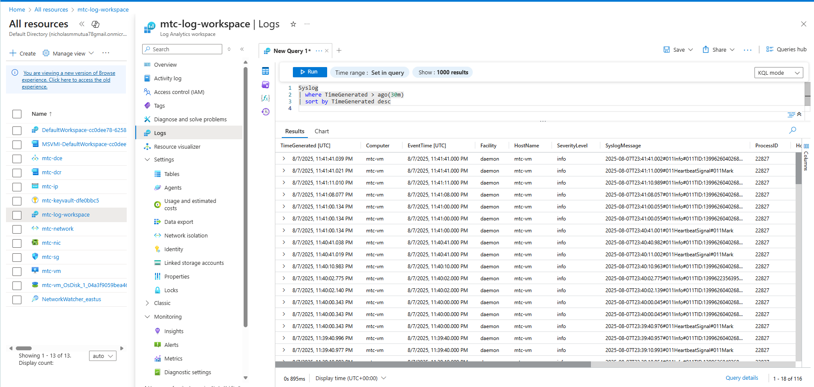

#### 📄 Performance Counters Query (KQL)

```
Perf
| where TimeGenerated > ago(30m)
| summarize avg(CounterValue) by Computer, ObjectName, CounterName
| order by Computer, ObjectName, CounterName
```
📷 Screenshot:

### Performance Logs Collected
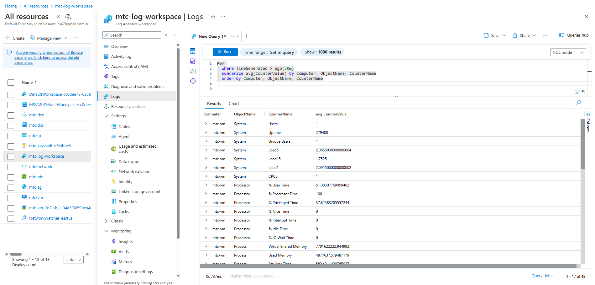

## ✅ Outcome
-     This configuration enables end-to-end monitoring for the VM, providing both platform metrics and guest OS logs, all automated through Terraform and integrated into Azure Monitor.

## Terraform on Azure — CI/CD with GitHub Actions (OIDC + Remote Backend)

This guide documents the exact steps i followed to:
- **Automate Terraform** with GitHub Actions (plan on PR, apply on `main`).
- **Move Terraform state** to **Azure Storage** (remote backend).
- **Use OpenID Connect (OIDC)** for passwordless GitHub → Azure login.
- **Configure repo secrets/variables** for a clean, reusable pipeline.

## 🚀 Quickstart

```bash
# 0) Azure login (local, for first run)
az login
az account set -s "cc0dee78-6258-4f70-8273-e10b2a652293"

# 1) Initialize remote backend (already created)
terraform init -reconfigure

# 2) Format & validate
terraform fmt -recursive
terraform validate

# 3) Plan (local)
terraform plan -out tfplan

# 4) Apply (local)
terraform apply -auto-approve tfplan

## 2) Create Azure Storage for Remote State

We store Terraform state in an Azure Storage Account with soft-delete/versioning enabled.

### 2.1 Variables

```bash
RG="tfstate-rg-nm"
LOC="eastus"
SA="tfstatenm77536"       # globally unique
CONTAINER="tfstate"
KEY="terraform.tfstate"
```

### 2.2 Create resource group and storage

```bash
# resource group
az group create --name "$RG" --location "$LOC"

# storage account
az storage account create   --name "$SA"   --resource-group "$RG"   --location "$LOC"   --sku Standard_LRS   --encryption-services blob

# enable soft-delete + versioning
az storage account blob-service-properties update   --account-name "$SA"   --resource-group "$RG"   --enable-delete-retention true   --delete-retention-days 7   --enable-versioning true

# create the container for state
az storage container create   --name "$CONTAINER"   --account-name "$SA"
```

**Screenshots**  
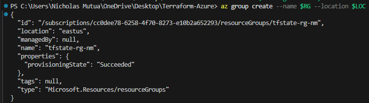  
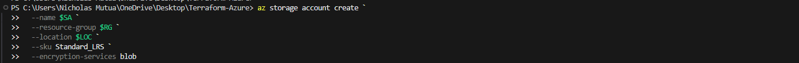  
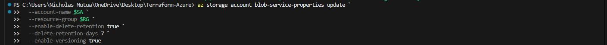  
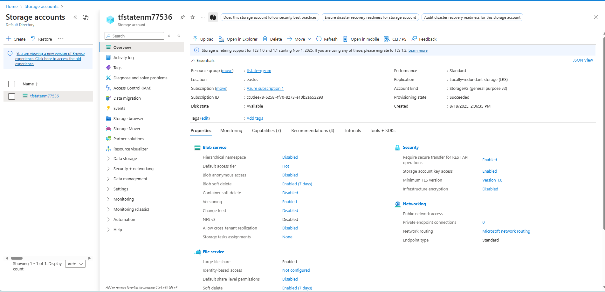

---

## 3) Configure OIDC (GitHub → Azure)

1. **Create an App Registration** (or an Azure AD enterprise app) that represents your GitHub Actions runner (we named ours `gha-terraform-sp`).  
2. **Add a Federated Credential** with:
   - Issuer: `https://token.actions.githubusercontent.com`
   - Subject (example for PRs): `repo:<OWNER>/<REPO>:pull_request`
     - You can add another for branch builds: `repo:<OWNER>/<REPO>:ref:refs/heads/main`
   - Audience: `api://AzureADTokenExchange`
3. Assign roles to the app (least privilege):
   - Subscription scope: **Contributor**
   - Storage account (state) scope: **Storage Blob Data Contributor**

**Screenshot**  
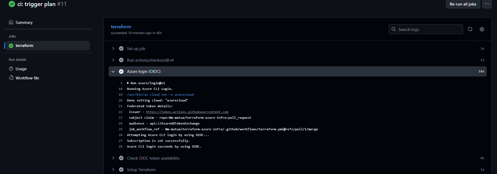

---

## 4) Repository Secrets / Variables

Added these **Repository secrets** (Settings → *Secrets and variables* → *Actions*):

| Secret | Purpose |
|---|---|
| `AZURE_CLIENT_ID` | App registration (OIDC) client ID |
| `AZURE_TENANT_ID` | Azure tenant ID |
| `AZURE_SUBSCRIPTION_ID` | Subscription ID |
| `TF_BACKEND_RG` | Resource group of the state SA |
| `TF_BACKEND_SA` | Storage account name for state |
| `TF_BACKEND_CONTAINER` | Container name (e.g., `tfstate`) |
| `TF_BACKEND_KEY` | State blob key (e.g., `terraform.tfstate`) |
| `ADMIN_SSH_PUBKEY` | SSH public key used by the VM `adminuser` |
| `SP_OBJECT_ID` | (Optional) Object ID of the OIDC app for Key Vault policy |

**Screenshot**  
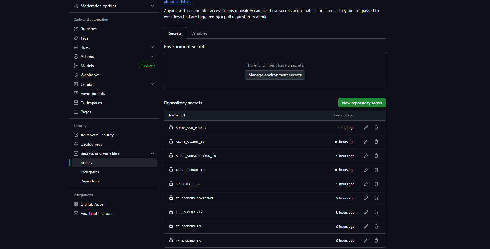

---

## 5) Terraform configuration

### 5.1 Backend (remote state)

In your `main.tf` keep an empty backend block (we pass real values at init time via the workflow):

```hcl
terraform {
  backend "azurerm" {}
}
```

### 5.2 Useful variables

```hcl
# variables.tf
variable "admin_ssh_pubkey" {
  description = "SSH public key for the VM admin user"
  type        = string
}

variable "sp_object_id" {
  description = "Object ID of the GitHub OIDC Service Principal"
  type        = string
  default     = null
}

# Optional switch to avoid runner-specific local-exec in CI
variable "enable_local_exec" {
  type    = bool
  default = false
}
```

Use the variable in your VM resource instead of reading a local file on the runner:

```hcl
resource "azurerm_linux_virtual_machine" "mtc-vm" {
  # ...
  admin_username = "adminuser"
  admin_ssh_key {
    username   = "adminuser"
    public_key = var.admin_ssh_pubkey
  }
}
```

### 5.3 Disable runner-specific local-exec in CI (safe default)

```hcl
provisioner "local-exec" {
  when       = create
  on_failure = continue
  command    = "echo local-exec disabled"
}
```

---

## 6) GitHub Actions workflow (`.github/workflows/terraform.yml`)

This is the CI/CD pipeline we used. It plans on PRs and applies on push to `main`.  
It logs in to Azure via **OIDC**, configures the **remote backend**, and runs `fmt`, `validate`, `plan` (+ uploads `plan.txt`).

```yaml
name: Terraform CI/CD

on:
  pull_request:
    branches: [ main ]
  push:
    branches: [ main ]

permissions:
  id-token: write        # OIDC
  contents: read
  pull-requests: write   # to post plan comments

jobs:
  terraform:
    runs-on: ubuntu-latest
    env:
      ARM_USE_OIDC: "true"
      ARM_CLIENT_ID: ${{ secrets.AZURE_CLIENT_ID }}
      ARM_TENANT_ID: ${{ secrets.AZURE_TENANT_ID }}
      ARM_SUBSCRIPTION_ID: ${{ secrets.AZURE_SUBSCRIPTION_ID }}
      TF_VAR_admin_ssh_pubkey: ${{ secrets.ADMIN_SSH_PUBKEY }}
      TF_VAR_sp_object_id: ${{ secrets.SP_OBJECT_ID }}

    steps:
      - name: Checkout
        uses: actions/checkout@v4

      - name: Azure login (OIDC)
        uses: azure/login@v2
        with:
          client-id: ${{ secrets.AZURE_CLIENT_ID }}
          tenant-id: ${{ secrets.AZURE_TENANT_ID }}
          subscription-id: ${{ secrets.AZURE_SUBSCRIPTION_ID }}

      - name: Setup Terraform
        uses: hashicorp/setup-terraform@v3
        with:
          terraform_version: 1.7.5

      - name: Init (remote backend)
        run: |
          terraform init -reconfigure             -backend-config="resource_group_name=${{ secrets.TF_BACKEND_RG }}"             -backend-config="storage_account_name=${{ secrets.TF_BACKEND_SA }}"             -backend-config="container_name=${{ secrets.TF_BACKEND_CONTAINER }}"             -backend-config="key=${{ secrets.TF_BACKEND_KEY }}"

      - name: Format
        run: terraform fmt -check -recursive

      - name: Validate
        run: terraform validate

      - name: Plan
        run: |
          terraform plan -input=false -out=tfplan -no-color
          terraform show -no-color tfplan > plan.txt

      - name: Upload plan
        if: always()
        uses: actions/upload-artifact@v4
        with:
          name: terraform-plan
          path: |
            tfplan
            plan.txt

      - name: Apply (only on main)
        if: github.event_name == 'push' && github.ref == 'refs/heads/main'
        run: terraform apply -input=false -auto-approve tfplan
```

**Screenshots**  
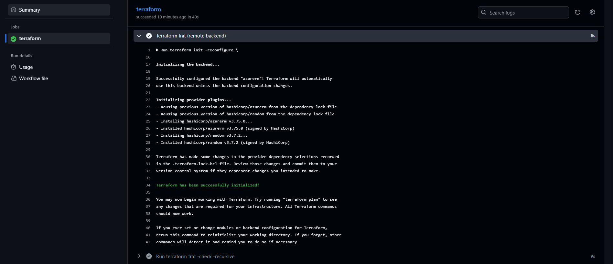  
  
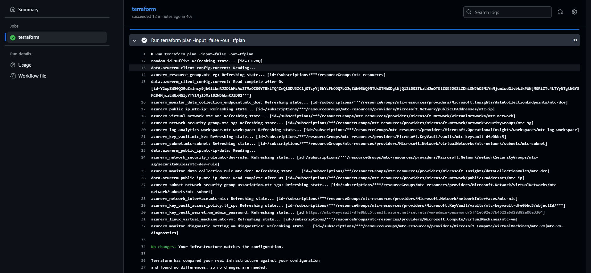

---

## 7) What i fixed along the way (troubleshooting)

- **OIDC errors** (`ACTIONS_ID_TOKEN_REQUEST_URL missing`, `AADSTS700025 No matching federated identity`):  
  - Add `permissions: id-token: write` in the workflow.  
  - Ensure the Federated Credential subject matches the event (e.g., `pull_request` or `ref:refs/heads/main`).

- **Secret scanning blocked push**: Removed plaintext creds (JSON) from the repo. Use OIDC + secrets only.

- **Runner file path issues** (`file("~/.ssh/...")`): Stop reading files from the runner. Use variables (`var.admin_ssh_pubkey`) wired from secrets.

- **Provisioner failures** (PowerShell not in PATH on Ubuntu): Disabled `local-exec` in CI or gated it with `enable_local_exec` for local use only.

---

## 8) Verify

- Action run shows **Azure login succeeded** and **Terraform init/validate/plan** succeed.  
- Remote state blob exists in the storage container.  
- On push to `main`, the pipeline **applies** and reports outputs.

---

---

## 9) Optional extras

- Post plan as a PR comment (via `actions/github-script`).  
- Add `tflint`/`checkov` before plan.  
- Require manual approval before Apply (GitHub Environments).  
- Add a `workflow_dispatch` trigger for manual runs.

---

## 📸 Screenshots

### Terraform output after applying the configuration on Azure:
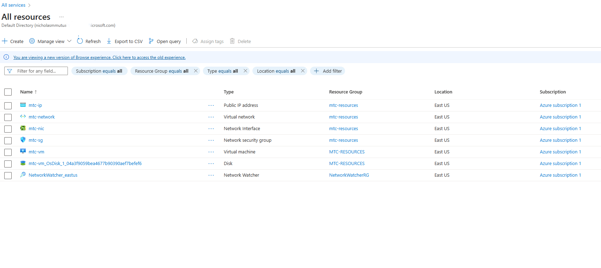

### Ansible Playbook Run Output
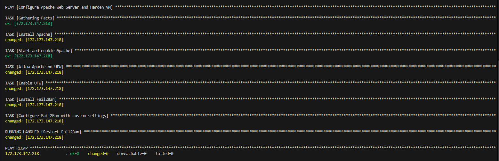

### Apache2 Service Running
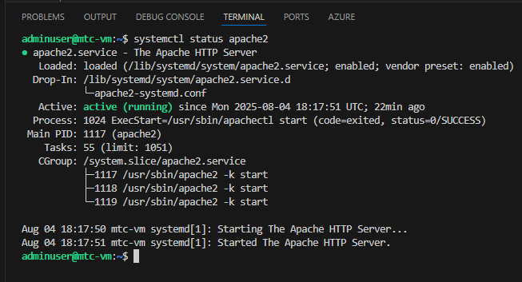

### Apache2 Ubuntu Default Page
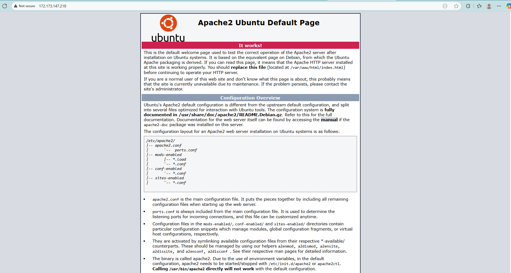

### Fail2Ban SSH Jail Status
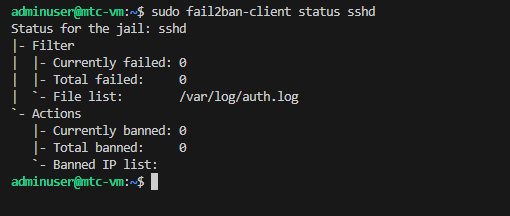

### Terraform Plan before Applying
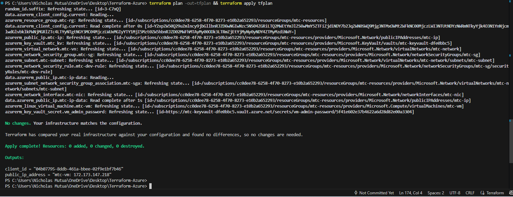

### Terraform Output after Applying the Configuration on Azure
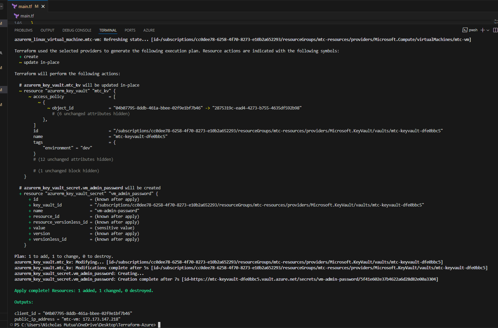

### Azure Key Vault Secret Created Successfully
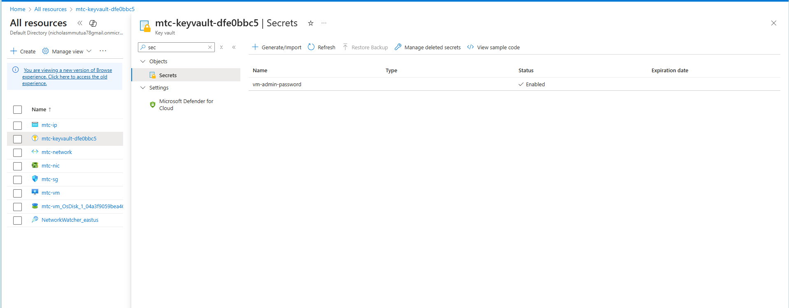

### Azure Key Vault Secret Details Page
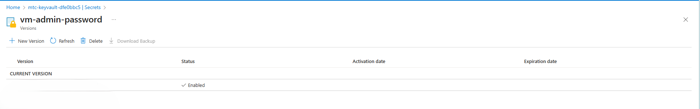

### Azure Key Vault Access Policy Assigned
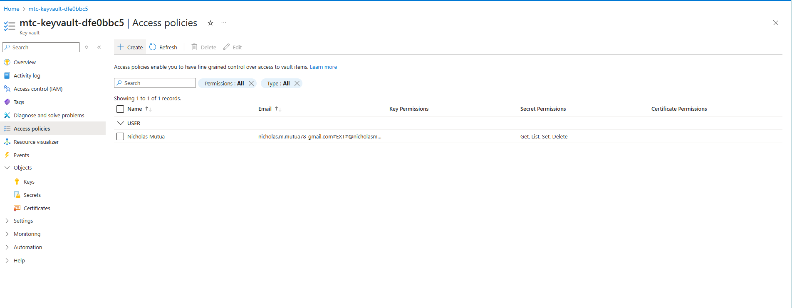

### Azure Log Analytics Workspace Created
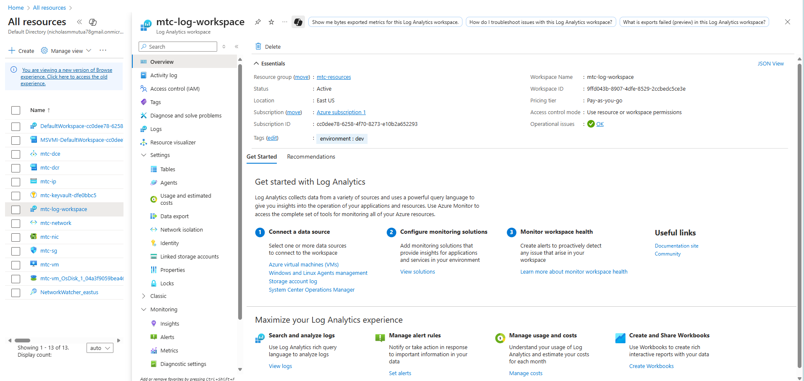

### Azure Monitor Agent Installed on Linux VM
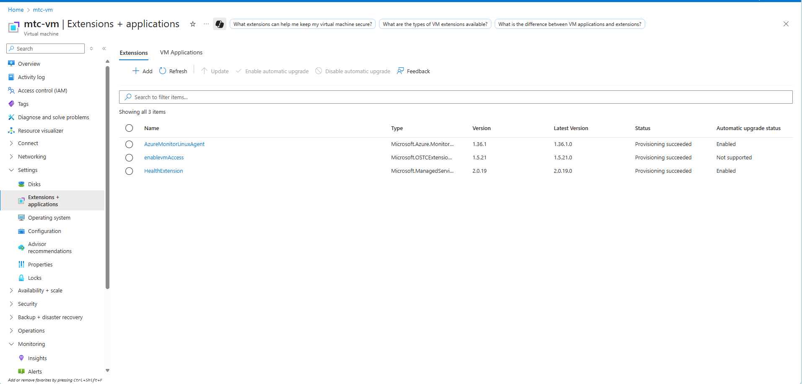

### Terraform Output — Workspace Created
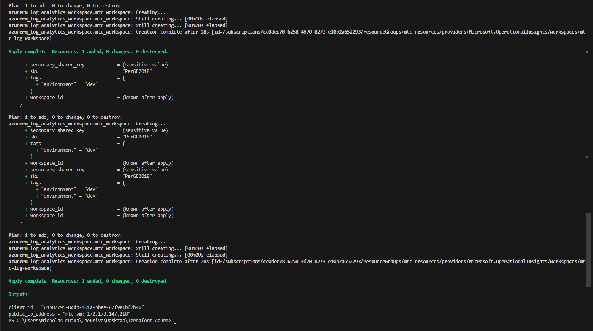

### Terraform Output — Data Collection Endpoint Created
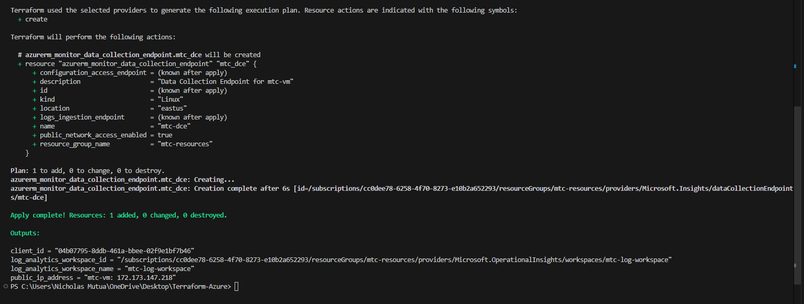

### Terraform Output — Data Collection Rule Created
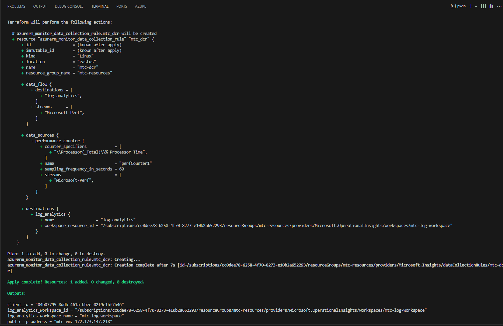

### Terraform Output — DCR Association Created
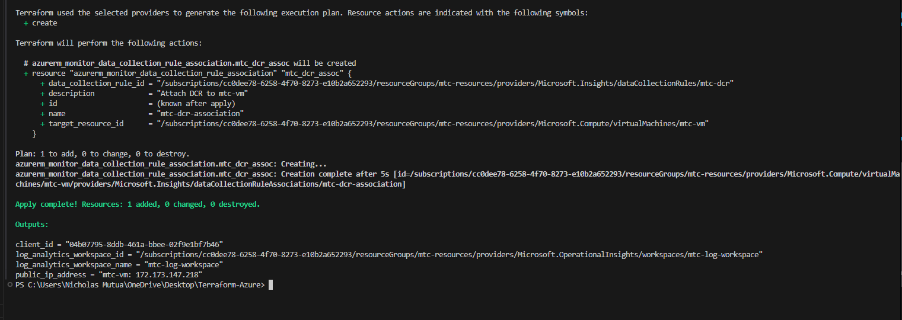

### Data Collection Endpoint Configured
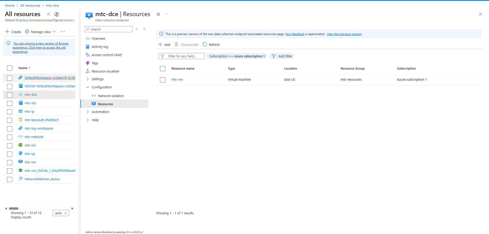

### Data Collection Rule Configured
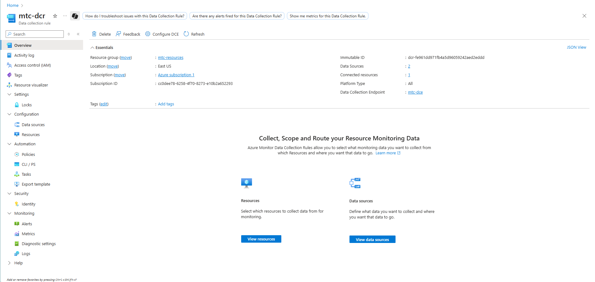

### VM Associated with DCR**
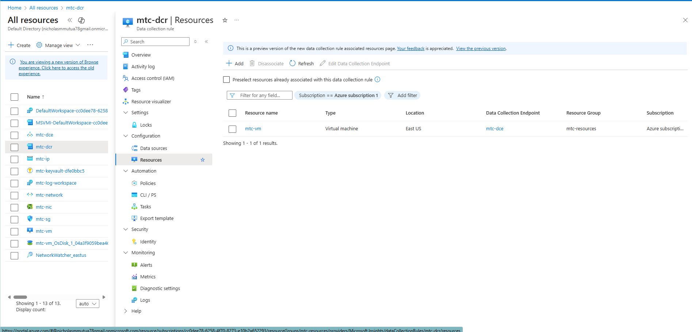

### Syslog Performance Counters Configured**
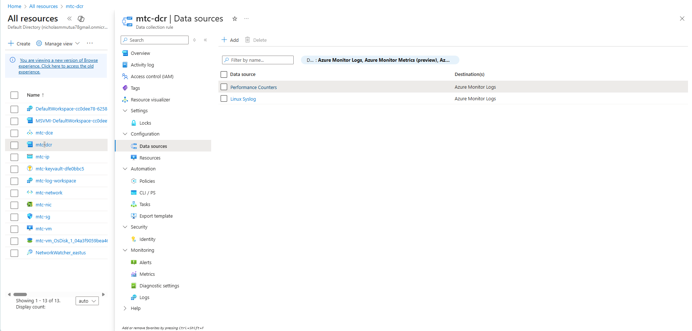

## Planned Enhancements (Roadmap)

- 🔧 [x] Integrate Ansible to configure Apache and harden the VM
- 🛡️ [x]Harden VM with UFW, Fail2Ban, and best security practices
- 🔐 [x]Secure credentials using Azure Key Vault
- 📊 [x]Enable Azure Monitor and Log Analytics
- ⚙️ [x]Automate with GitHub Actions CI/CD

 👤 Author
GitHub Profile: [**Nm-mutua**](https:github.com/Nm-mutua).

## Credits
This project is inspired by the [FreeCodeCamp Terraform on Azure tutorial](https://www.youtube.com/watch?v=V53AHWun17s&list=WL&index=4)

